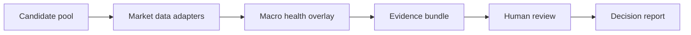

# Stock Analysis Plus

A public-safe stock research workflow kit for shortlist generation, macro overlays, evidence bundles, and market-data adapters.

This repository packages the public-facing shape of a larger local market research system: stock ideas should move through reviewable data adapters, macro context, evidence bundles, and human decision gates instead of becoming opaque one-off notes.

- Portfolio homepage: <https://firejw.github.io/stock-analysis-plus/>
- Security notes: [docs/security-and-privacy.md](docs/security-and-privacy.md)

## What It Does

- Lists reusable workflow modules through a small Python CLI.
- Provides public month-end shortlist source fragments, templates, and review primitives; legacy compiled entrypoints are intentionally omitted from this public repository.
- Adds macro health overlays for market-regime context before candidate review.
- Includes Longbridge-oriented market-data adapter references and runners for quote, screen, ownership, and planning flows.
- Keeps examples template-based so the repository can be inspected without live credentials or private operating data.

## Workflow Shape



## Repository Layout

```text
skills/
  longbridge/              Longbridge CLI/SDK adapters and references
  macro-health-overlay/    Macro overlay runner and public request template
  month-end-shortlist/     Stock pool, evidence bundle, shortlist, and report scripts
docs/
  index.html               GitHub Pages portfolio homepage
  security-and-privacy.md  Public safety and privacy boundary
stock_analysis_plus/
  cli.py                   Lightweight inventory CLI
tests/
  test_cli.py              CLI smoke coverage
```

## Quick Start

```powershell
py -3 -m pip install -e .
py -3 -m stock_analysis_plus.cli list
py -3 skills\macro-health-overlay\scripts\macro_health_overlay.py --help
```

Some workflows can use live market-data tools when configured locally. No API keys are committed or required for repository inspection. The CLI marks packaged workflows as `partial` when public-safe extraction omits a legacy compiled runtime artifact.

## Portfolio Framing

This project is useful as a software and AI workflow portfolio artifact because it shows:

- extracting a public-safe subset from a private research workspace
- separating market-data collection from decision reporting
- making AI-assisted research reviewable through explicit evidence artifacts
- preserving human review gates around investment workflows
- documenting privacy boundaries before publishing code

## Documentation

- [GitHub Pages homepage](https://firejw.github.io/stock-analysis-plus/)
- [Security and privacy](docs/security-and-privacy.md)
- [Longbridge skill references](skills/longbridge/SKILL.md)
- [Macro health overlay skill](skills/macro-health-overlay/SKILL.md)
- [Month-end shortlist examples](skills/month-end-shortlist/examples/)

## Public Safety Boundary

This repo is a new repository with new Git history. It is not a fork and does not contain:

- `.ai/`, `.claude/`, recovered artifacts, or rollout logs
- browser profile files or cookies
- personal Windows paths or vault paths
- private API keys or tokens
- generated spreadsheets, reports, screenshots, or live research outputs

The project is for research workflow automation and software demonstration only. It does not place trades, change brokerage accounts, or provide financial advice.

## Attribution

Source material was extracted from a local fork of the Apache-2.0 licensed `anthropics/financial-services` ecosystem and then reduced into a public-safe stock-analysis subset.
